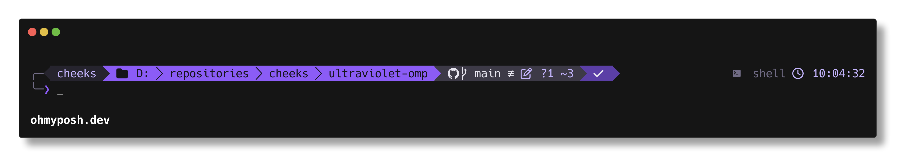

# ultraviolet

A purple/grey hacker theme for [oh-my-posh](https://ohmyposh.dev).



Dark greys, sharp powerline edges, and violet accents — with a box-drawing frame,
git status at a glance, and an exit-code readout that flips to alert red when a
command fails.

## Features

- **Framed two-line prompt** — `╭─` / `╰─❯` box-drawing frame in muted grey; the
  prompt character turns red after a failed command
- **Session block** — username (plus `@host` when connected over SSH); flips to
  alert red with a ⚡ when running as root/admin, so privileged shells are
  impossible to miss
- **Violet path** — agnoster-short style, capped at 3 levels deep
- **Git block** — branch, upstream icon, ahead/behind, working/staged change
  counts in light violet, stash count
- **Status block** — violet ✓ on success, red ✗ with the exit code on failure
- **Right side** — execution time of the last command (shown when over 500 ms),
  current shell, and a clock
- **Transient prompt** — past prompts collapse to a single `❯` to keep scrollback clean

## Palette

| Role          | Hex       |
| ------------- | --------- |
| deep          | `#16141C` |
| surface       | `#26242E` |
| overlay       | `#3D3A47` |
| muted         | `#716C85` |
| silver        | `#A9A5B8` |
| text          | `#E8E6F0` |
| violet        | `#8B5CF6` |
| violet-deep   | `#5B3FA6` |
| violet-bright | `#C4B5FD` |
| alert         | `#F2557E` |

All colors are defined once in the config's `palette` block, so retuning the
theme is a one-place edit.

## Requirements

- [oh-my-posh](https://ohmyposh.dev/docs/installation/windows) v19 or newer
- A [Nerd Font](https://www.nerdfonts.com/) installed and set in your terminal

## Installation

Download the theme:

```powershell
# PowerShell
Invoke-WebRequest https://raw.githubusercontent.com/notreallycheeks/ultraviolet-omp/main/ultraviolet.omp.json -OutFile "$HOME\ultraviolet.omp.json"
```

```bash
# bash / zsh
curl -fsSL -o ~/ultraviolet.omp.json https://raw.githubusercontent.com/notreallycheeks/ultraviolet-omp/main/ultraviolet.omp.json
```

Then initialize oh-my-posh with it in your shell profile:

```powershell
# PowerShell ($PROFILE)
oh-my-posh init pwsh --config "$HOME\ultraviolet.omp.json" | Invoke-Expression
```

```bash
# bash (~/.bashrc)
eval "$(oh-my-posh init bash --config ~/ultraviolet.omp.json)"

# zsh (~/.zshrc)
eval "$(oh-my-posh init zsh --config ~/ultraviolet.omp.json)"
```

```fish
# fish (~/.config/fish/config.fish)
oh-my-posh init fish --config ~/ultraviolet.omp.json | source
```

## Startup header (optional)

`ultraviolet-header.ps1` replaces the default PowerShell startup banner with a
hardware/OS summary rendered in the theme's palette — a gradient PowerShell
logo (a sheared parallelogram with the `❯_`), user, OS build, CPU, GPU, a RAM
usage bar (flips to alert red above 85%), disk usage, and uptime, framed to
chain visually into the prompt (the `█` runs below are a solid violet-gradient
fill in the real render):

```text
╭─ ultraviolet
│       ██████████████    user  cheeks@developer
│      ██████████████     os    Windows 11 Pro 25H2 · 26200.7623
│     ██████████████      cpu   AMD Ryzen 7 5800X 8-Core Processor
│    ███❯_█████████       gpu   NVIDIA GeForce RTX 3060 Ti
│   ██████████████        mem   12.4 / 31.9 GB  ━━━━━━━━━━━━ 39%
│  ██████████████         disk  518 / 931 GB (C:)
│ ██████████████          up    2d 4h 13m · pwsh 7.6.4
╰─
```

It gathers everything from the registry and .NET (no CIM/WMI), so it runs in
well under 100 ms and never pushes profile load over the 500 ms threshold that
makes pwsh print `Loading personal and system profiles took NNNms.`

Download it next to the theme, then call it from your PowerShell `$PROFILE`
(before the oh-my-posh init) — guarded so it only fires in interactive shells:

```powershell
if ($Host.Name -eq 'ConsoleHost' -and -not [Console]::IsOutputRedirected -and
    -not ([Environment]::GetCommandLineArgs() -match '^-{1,2}(c|command|f|file|encodedcommand)$')) {
    & "$HOME\ultraviolet-header.ps1"
}
```

If the shell is launched without `-NoLogo` (Start-menu shortcuts give you no
way to add it), the header detects the stock `PowerShell 7.x.x` banner sitting
alone at the top of a fresh buffer and erases it before printing, so the header
is always the first thing on screen. Launching with `-NoLogo` where you can
(e.g. a Windows Terminal profile's `commandline`) is still nicer — it avoids
the one-frame banner flash and also suppresses the slow-profile-load notice —
but it is no longer required.

## License

[MIT](LICENSE)
